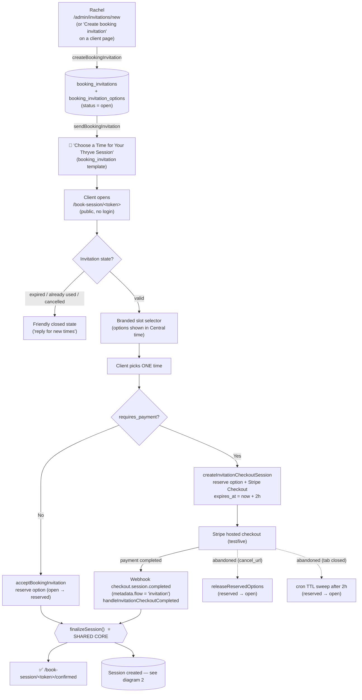
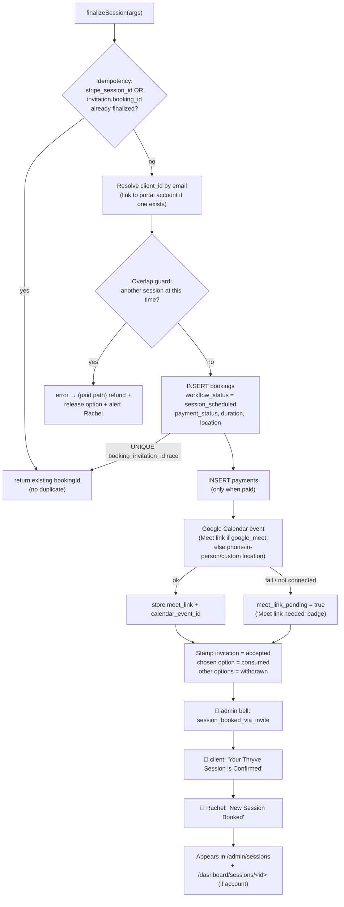
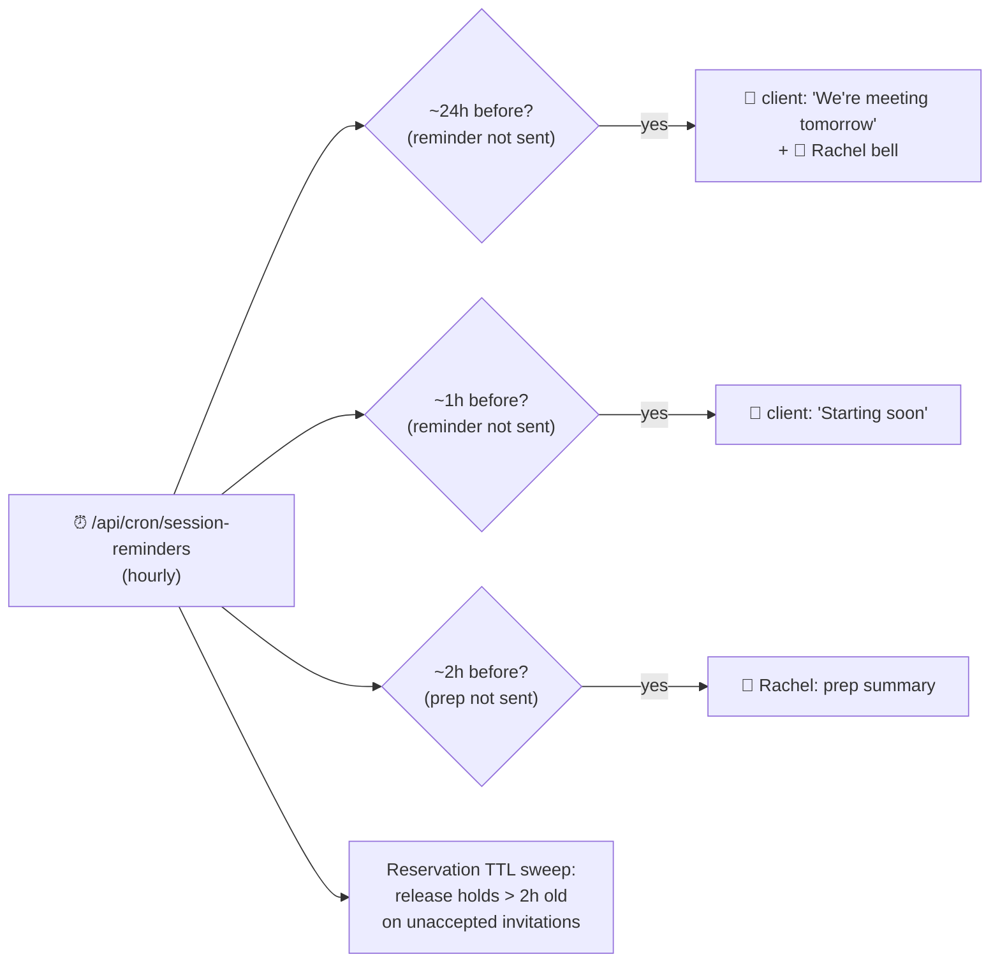
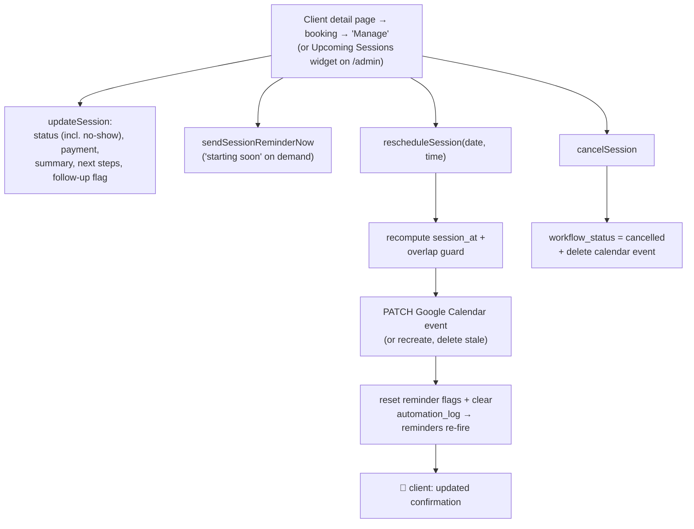
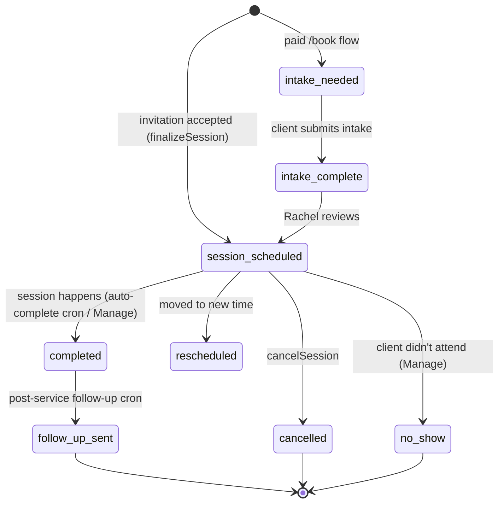

# Booking Invitation → Session — Workflow Diagrams

Visual reference for the admin-initiated booking workflow. Open in VS Code's
Markdown preview (or any Mermaid-aware viewer) to render the diagrams.

---

## 1. End-to-end flow (creation → selection → finalize)

---

## 2. Inside finalizeSession() — both branches converge here

---

## 3. Automated reminders (hourly session-reminders cron)

---

## 4. Managing a session (admin) — Manage panel + Upcoming widget

---

## 5. Session status lifecycle (workflow_status)

---

### Key guarantees baked in
- **One invitation → one session** (UNIQUE `booking_invitation_id`; finalize is idempotent on the `23505` race).
- **No double-booking** at the same time (atomic option reserve + cross-session overlap guard).
- **No charge without a session** (paid-finalize conflict → automatic refund + admin alert).
- **Calendar/email never block a booking** (best-effort; failures surface as `meet_link_pending`).
- **All times Central (America/Chicago)** with DST handled by `localCentralToUtcIso`.
